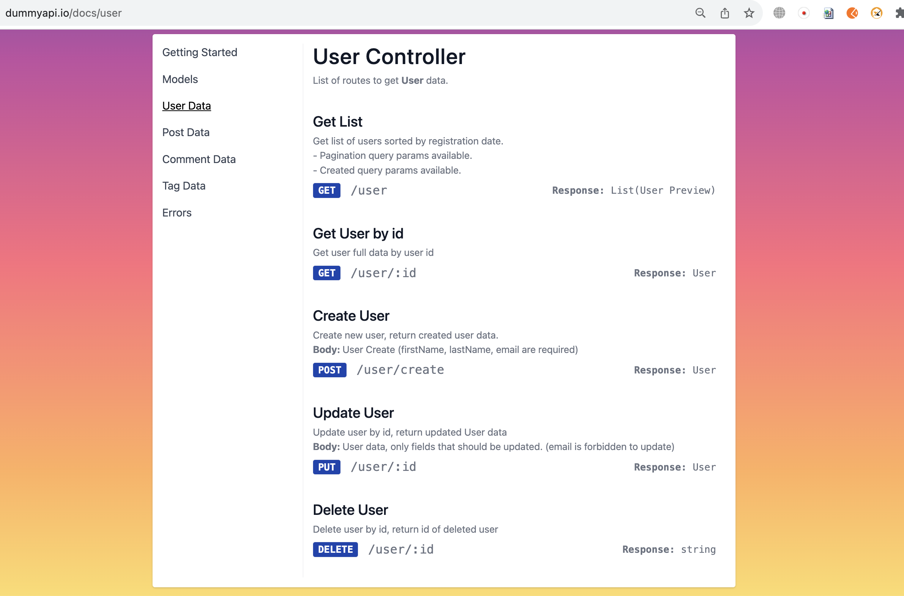
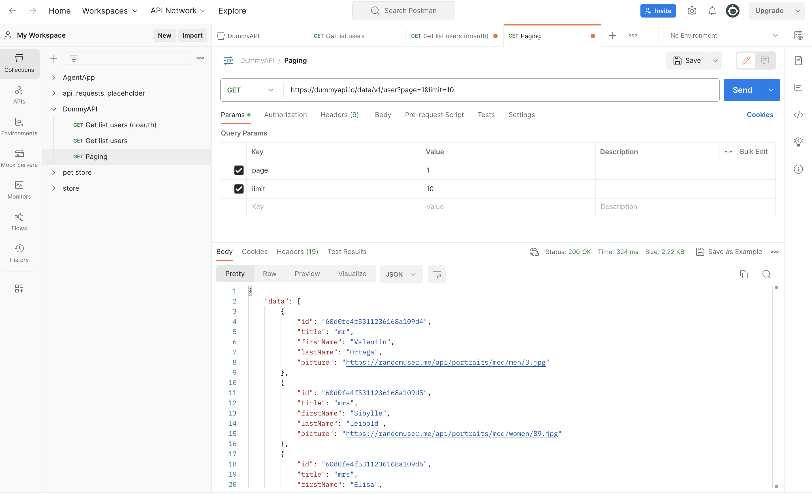
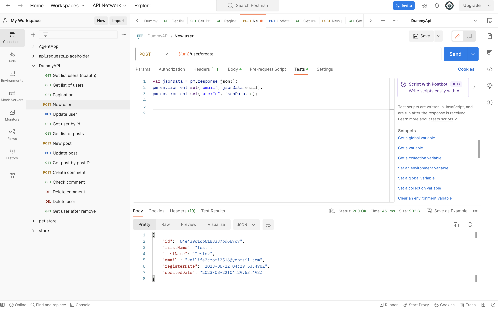
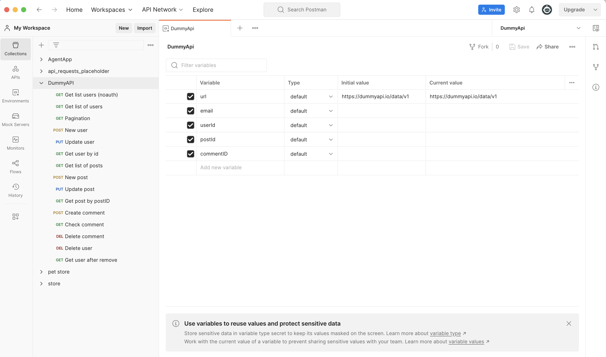
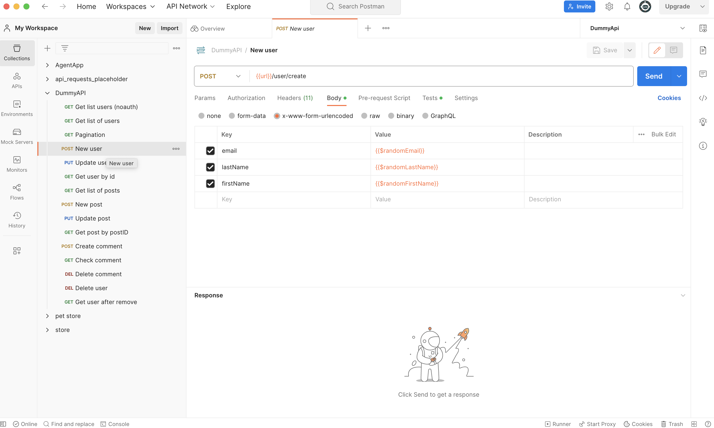
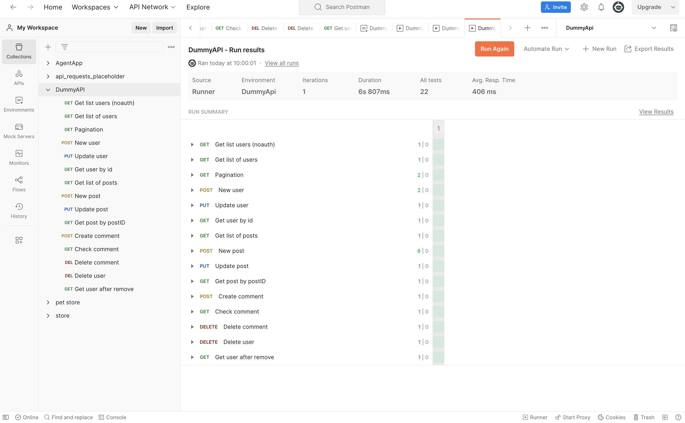

# Чтение документации Dummyapi и создание postman colections + tests

 

### Технологии

  <code></code>

### Что делаем
* Читаем документацию
* Собираем запросы 
* Вводим окружение и переменные
* Составляем тесты
* Запускаем Test Run

___

##### Согласно документации https://dummyapi.io/docs составляем запросы к каждому методу

  <code></code>

##### К  https://dummyapi.io/data/v1/ для каждого запроса пишем свой эндпоинт и согласно документации заполняем запрос

  <code></code>

##### Для создоваемых сущностей пропишем команду создания переменных в нашем окружении

  <code></code>

  <code></code>

##### А для того чтоб не вводить новые параметры при создании user, создаем генерируемые данные в Urlencoded 

  <code></code>

##### Для каждого запроса создадим тесты проверки код статуса и для сущностей проверку в теле ответа и запускаем тест колекции.

  <code></code>

